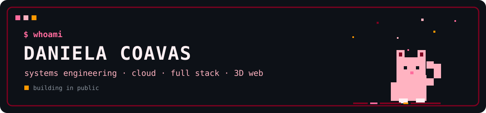

 

  

 

## ✦ About

Systems Engineering student focused on building **modern software and cloud solutions**.

I especially enjoy creating **interactive web experiences** and turning ideas into polished projects.

 

 

## ◈ GitHub Stats

 

  

 

## ⚡ Main Stack

 

## ✧ Featured Projects

<table>
<tr>
<td width="50%" valign="top">

### 🎁 [3D Memory Gift Template](https://github.com/dannysophi17/3d-memory-gift-template)

Open-source template for building personalized interactive 3D memory experiences.

`Next.js` `TypeScript` `Three.js`

 

</td>
<td width="50%" valign="top">

### 🌌 [3D Portfolio](https://github.com/dannysophi17/portafolio-universo)

Interactive developer portfolio designed as a navigable 3D universe.

`Next.js` `React Three Fiber` `AWS`

 

</td>
</tr>

<tr>
<td width="50%" valign="top">

### 🔥 [GasCare Senior](https://github.com/dannysophi17/GasCare_Senior)

IoT system designed around gas detection and safer home monitoring.

`ESP32` `IoT` `MySQL`

 

</td>
<td width="50%" valign="top">

### 🕹️ [Tareas Arcade](https://github.com/dannysophi17/Tareas-arcade-final)

Retro-inspired task management web application with authentication and user features.

`Angular` `TypeScript` `REST API`

 

</td>
</tr>
</table>

 

### `always building something new`

 

<a href="https://dcoavas.com">Portfolio</a>
&nbsp;&nbsp;•&nbsp;&nbsp;
<a href="https://www.linkedin.com/in/daniela-coavas-desarrolladoraweb/">LinkedIn</a>

Thanks for stopping by ✦

